Boiler Temperature Monitor (ESP32)
An intelligent, low-power temperature monitoring solution for solar water heaters using ESP32. Designed for Home Assistant integration with support for battery-powered operation and Over-the-Air (OTA) updates.

Project Overview
This project provides a reliable way to monitor water temperature in solar water heaters. It is optimized for battery-powered devices, ensuring long operational life while maintaining seamless connectivity with Home Assistant via MQTT.

Features
Accurate Temperature Sensing: Robust sensor integration for water heaters.

Power Optimization: Intelligent power management; the sensor only draws power when a reading is taken.

OTA Updates: Secure firmware updates over-the-air via HTTP.

Smart Home Integration: Data reporting via MQTT to Home Assistant.

Circuit Diagram

Instead of using a traditional transistor, this design utilizes the ESP32 GPIO 25 as a "smart GND." By pulling this pin to LOW, the circuit is completed and the sensor is powered only during the measurement cycle.

Wiring
Sensor GND: Connected directly to GPIO 25 on the ESP32.

Control: The ESP32 firmware manages the sensor power state by switching GPIO 25 to LOW for readings and keeping it in a high-impedance state otherwise.

Getting Started
Repository Setup: Clone this repository to your machine.

Configuration: Update the config file with your WiFi credentials and MQTT broker details.

Initial Flash: Connect your ESP32 via USB and flash the firmware using PlatformIO.

Deploy: Once initially flashed, future updates can be deployed wirelessly via OTA.

License
This project is licensed under the MIT License.
